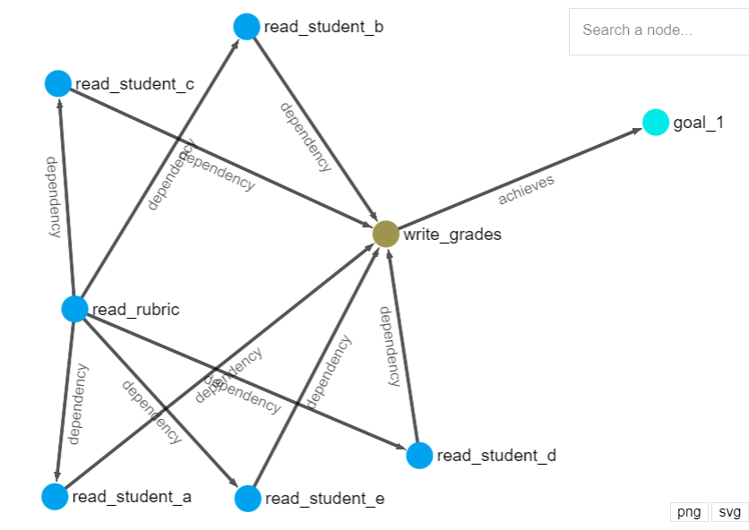

Langur makes it simple to build consistent, observable, and portable LLM agents.

> ⚠️ Langur is early in development. Expect frequent breaking changes. Depending on how it's configured Langur may be able to access arbitrary files or run code - use at your own risk.

## Installation
```
pip install langur
```

## Resources

Docs: Coming soon

Discord: https://discord.gg/wSBSP56V7U - Join the Discord to ask me any questions, report issues, or make suggestions!

## Getting Started

Here's a simple task solved using a Langur agent:
```python
from langur import Langur
from langur.connectors import Workspace

agent = Langur("Grade quizzes")
agent.use(
    Workspace(path="./workspace")
)
agent.run()
```
This is an example that automatically identifies quizzes in the provided filesystem, grades them, and puts them into an empty `grades.csv` file.

The agent will:
1. Plan out how to "Grade quizzes" based on what we told it to `.use()` (just `Workspace` in this case).
2. Execute those actions

### Signals

But maybe instead of executing the plan right way, we might want to observe it first. Instead of directly running `agent.run()`, we can pass a signal when running the agent:
```python
from langur import Signal

agent.run(until=Signal.PLAN_DONE)
```

### Visualization
To observe the agent's plan, we can look at the corresponding behavioral graph. This can be done like so:
```python
agent.save_graph_html("agent.html")
# ^ and then open the html with your browser.
# Or, in a Jupyter notebook:
agent.show()
```
For this simple example, the behavior graph might look something like:



Each node represents an action the agent plans to execute. 

### Caching

Let's say we like this behavior, and want to be able to re-use it - both to have consistent behavior and so the LLM doesn't have to plan out the same task again.

To do this, we can save the entire agent behavior graph in whatever state it's in, and re-run it later!

To save the agent behavior:
```python
agent.save("agent_with_great_plan.json")
```
then later, wherever and whenever you want:
```python
agent = Langur.load("agent_with_great_plan.json")
```

You could then continue the agent's execution from this point, where it has the plan you like in its behavioral state, by just running `agent.run()` once loaded.

Since this agent representation is plain JSON, you can even send agents over the wire, store them in a database, or do whatever you like really! They are completely portable and can be run on any system with Python and Langur installed.

### Going Further

Currently there is no documentation, however you can check out more examples by checking out the [challenges](./challenges) - which are different tasks meant to evaluate Langur's abilities in various capacities. You can also ask any questions you have in the [Langur Discord](https://discord.gg/wSBSP56V7U).

Langur provides some connectors in the library under `langur.connectors` - for example `Workspace` is a filesystem with basic read/write operations, or optional code execution features. Currently the connectors provided are extremely basic, these will grow over time. However Langur also makes it easy to define custom connectors, see [Building Connectors](#building-connectors).

If this plan/execute behavior just doesn't work for your agent use case, another key tenet of Langur's design is to have **modular behavior** - so you can customize it to fit your needs. Learn more in [Customizing Behavior](#customizing-behavior).

## Building Connectors

## How it Works
Langur's behavior is driven entirely by various "metacognitive workers" operating on a shared "cognition graph". These workers might manipulate the graph itself, or they might be interacting with the real-world and relaying that information to the graph. Workers that interact with the real-world are also called [Connectors](#building-connectors), and Langur is designed to make these [Connectors](#building-connectors) easy to implement to define new modes of interaction with the world.

Why this approach?
1. Modular behavior - Agent behavior is driven by several workers instead of a centralized system. This makes it easier to add new behavior without accidentally affecting all other facets of behavior, and makes it possible for advanced users to design and include their own custom behavior.
2. Observability - Being able to see a graph representing the agent's behavior is incredibly useful for visually understanding the agent's intent, and promotes sanity as a developer designing systems that operate on the graph.
3. Parallelizability - Workers can potentially run in parallel (or concurrently really) - and since many of these workers are using LLMs to operate on the graph, we can speed up these I/O bound prompts.
4. Serializability - Since all behavior state is stored in the graph, we can save and load the graph in order to save and load agent behavior.

## Customizing Behavior


## Known Issues
- Does not properly support multiple connectors of the same type (will be implemented)
- Behaviors cannot yet be arbitrarily combined, different combinations may not work as expected